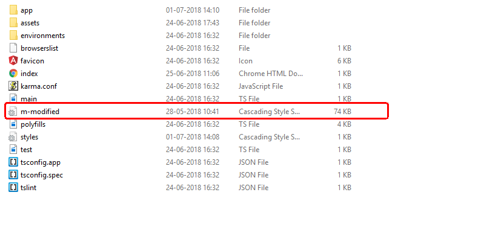
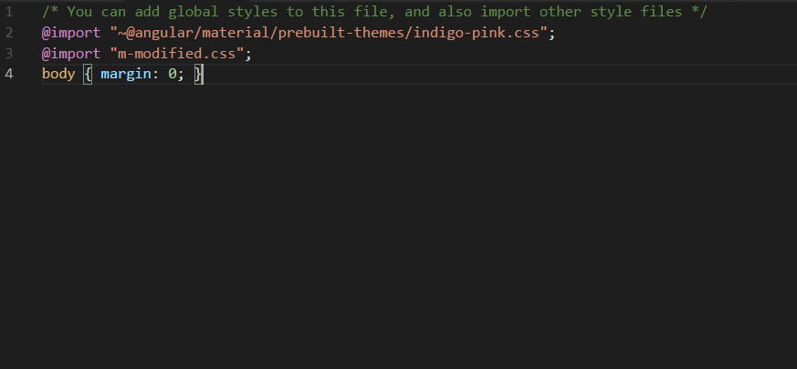

## Angular Material - Plugins

This is a source file for Angular Material Grid System. 

For the detailed post use this [link](https://ampersandacademy.com/tutorials/angular-material/responsive-grid-layout-in-angular-material)

Follow our detailed tutorials at [Ampersand Academy](https://ampersandacademy.com/tutorials/)

